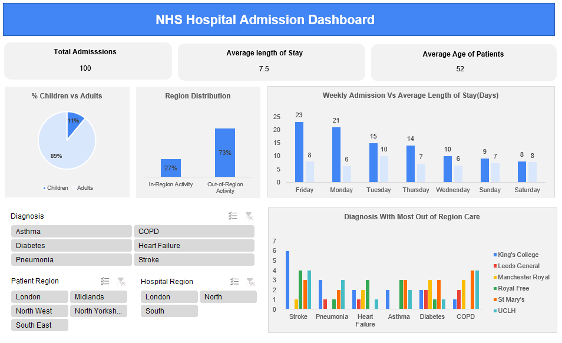
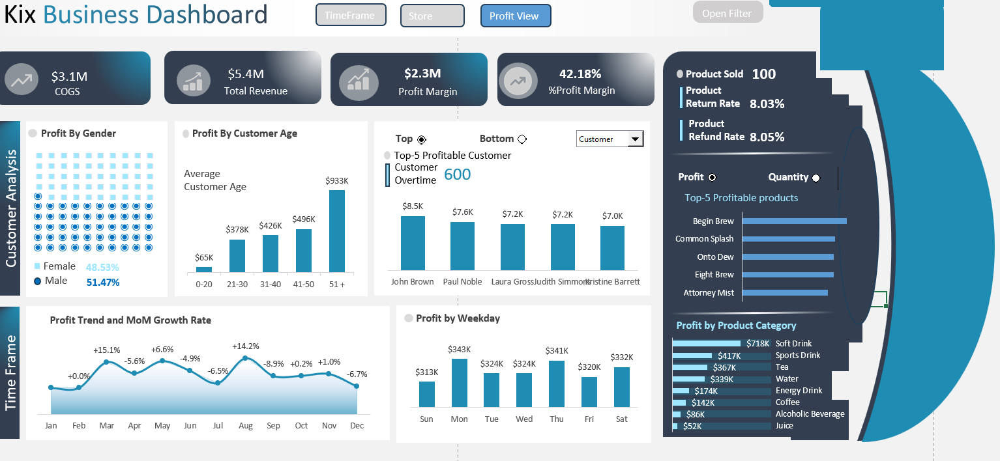
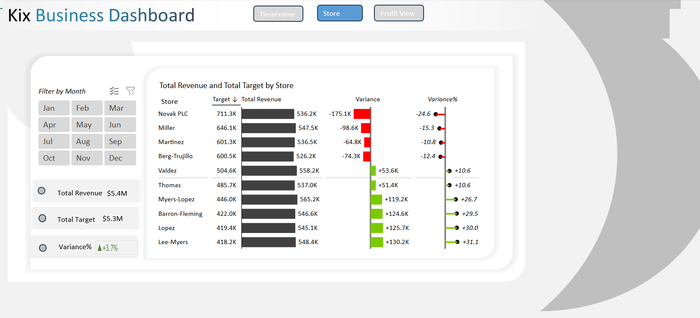
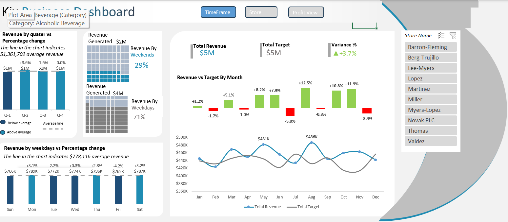

# Project 1

**Title:** [ NHS Accident & Emergency (A&E) Analysis](https://github.com/ugochukwu99/github.io/blob/main/NHS_Data_Analysis.pbix)

# Tools Used:
   - **Power BI Desktop** – for building interactive dashboards and visualizations  
   - **DAX (Data Analysis Expressions)** – to create dynamic KPIs, calculated measures, and business logic  
   - **Power Query (M Language)** – for data cleaning, transformation, and shaping before visualization
  
# Project Description:

   This project presents a comprehensive Power BI dashboard analyzing NHS Accident and Emergency (A&E) data from January 1, 2021 to January 30, 2025. It visualizes critical     KPIs such as total attendances, emergency admissions, and wait time performance across provider trusts and department types.

   The dashboard is divided into two main sections for targeted analysis:

**Accident Dashboard**
  Focuses on attendance trends, 4-hour wait targets, and provider-specific delays.

**Emergency Dashboard**
  Highlights emergency admissions, departmental performance, and provider-level comparisons.

  **Key findings:**
  
  _**Accident Dashboard**_

  What percentage of A&E patients are seen within 4 hours?
  
From the KPI card displayed in the Accident dashboard, 69% of patients were seen within the 4-hour NHS target window. While this represents the majority of cases, it still falls short of the NHS’s benchmark of 95%, indicating ongoing challenges in timely patient care delivery.

How has that performance changed year-over-year?

The data shows a clear performance trajectory over the five-year period. In 2021, 70% of patients were seen within the NHS’s 4-hour target. This percentage declined to 63% in 2022, likely reflecting increased strain on emergency services during that time. Encouragingly, the trend then reverses: performance improves to 69% in 2023, and further strengthens to 73% in both 2024 and early 2025. This upward trend suggests that operational adjustments, resource investments, or improved triage processes have positively impacted service delivery. While the current rate still falls below the NHS’s national 95% target, the consistent year-over-year improvement is a positive signal of recovery and system responsiveness.

Which NHS providers have the highest proportions of patients delayed beyond 4 hours?

The bar chart highlights several NHS trusts with a high percentage of patients waiting beyond the 4-hour target. Notably, Hull University Teaching Hospitals NHS Trust leads with 45% of patients delayed, followed closely by The Shrewsbury and Telford Hospital NHS Trust (43%) and University Hospitals Birmingham NHS Foundation Trust (42%). These elevated delay rates may reflect systemic challenges such as overcrowding, staff shortages, or bed availability issues. Identifying these trusts enables targeted performance improvement initiatives and resource planning to address bottlenecks in urgent care delivery.

Which types of departments (e.g., Major A&E, Minor Injury, Specialty) handle wait times better?

According to the chart Minor Injury Units and Specialty Departments generally perform better, with fewer breaches of the 4-hour target. Major A&E departments tend to have higher delays, likely due to the complexity and volume of cases handled.

 _**Emergency Dashboard**_
 
Are emergency admissions rising or falling over the four-year period?

The "Emergency Admission by Year" chart shows a consistent and measurable increase in emergency admissions from 2021 through 2024, with levels remaining high into early 2025. This sustained rise reflects growing pressure on emergency services, driven by identifiable factors such as an aging population, higher prevalence of chronic conditions. The data clearly signals that demand for emergency care is intensifying, and providers must scale capacity and triage systems to keep pace.

Has the NHS improved its responsiveness and service levels?

From a combined view of the trend charts and admission data, the NHS shows a modest improvement in responsiveness beginning in 2024. However, the increase in admissions has likely placed additional strain on resources, and overall performance remains below the national 95% compliance target.

Dashboard Overview:
# 🚑 Accident Dashboard 
  

# 🏥 Emergency Dashboard 
   

# Project 2

**Title:** NHS Workforce Data Interrogation and Manipulation

**SQL Code:**
[NHS Workforce Code](https://github.com/ugochukwu99/github.io/blob/main/NHS_Workforce.SQL)

**SQL Skills Used:**
Data Retrieval (SELECT): Queried and extracted specific information from the database.
Data Aggregation (SUM, COUNT): Calculated totals, such as sales and quantities, and counted records to analyze data trends.
Data Filtering (WHERE, BETWEEN, IN, AND): Applied filters to select relevant data, including filtering by ranges and lists.
Data Source Specification (FROM): Specified the tables used as data sources for retrieval

**Project Description:**
This project involves analyzing NHS workforce data using SQL to uncover trends, workforce distribution, and staff group insights over time. The goal is to use structured queries to filter, aggregate, and interpret the data, supporting data-driven understanding of NHS staffing patterns.

**Technology used:** SQL server

# Project 3

**Title:**  NHS Hospital Admission Analysis 

**Tools Used:** Microsoft Excel, Pivot Chart, Pivot Table, Slicers, Conditional Formatting,

**Project Description:**
This project presents a visual analysis of hospital admission trends within the NHS, providing key insights on patient demographics, regional activity, diagnosis trends, and hospital performance. The dashboard was built to support data-driven decision-making for healthcare providers and administrators.

**Key findings:**
- Which diagnosis is mostly likely to require out of region care?

  The dataset indicates that stroke is the most frequent diagnosis linked to out-of-region care, ranking in the top two    diagnoses for four out of the six hospitals included in the analysis. This trend likely reflects the urgent nature of stroke cases, where patients are transported to the nearest available facility regardless of regional boundaries to ensure immediate treatment. While the pattern is clear, it's important to note that the dataset is limited in size.

- What is the busiest admission day of the week across all hospitals? How does its average length of stay compare to the quietest day?

  Friday saw the highest admissions (23), topping 5 of 6 hospitals, while Saturday was the quietest (8). This pattern aligns    with healthcare trends: patients often avoid weekend stays, and specialist services may be reduced. Yet, Friday’s average     length of stay (8 days) is identical to Saturday’s and just two hours more than Monday’s, falling within an hour of five      other days. This suggests that while patient volumes vary, case complexity and care duration remain stable—key for planning   staffing and skill mix ahead of weekend surges.

**Dashboard Overview:**

# Project 4

**Title:** 
             
             Kix Beverages: Interactive Dashboards for Strategic Decision-Making
             (Analyzing Profitability, Store Performance, and Financial Trends)

**Tools Used:**

Power Query, Macros (VBA), Pivot Tables, Conditional Formatting, Charts for dynamic data visualization, Slicers for interactive filtering

**Project Description:** 

This project showcases a comprehensive Excel-based Business Intelligence solution for Kix Beverages, a beverage retail company aiming to enhance its decision-making through interactive dashboards. The project leverages Excel's data analysis and visualization capabilities, including PivotTables, PivotCharts, slicers, and Power Query, to extract insights across customer behavior, product profitability, store performance, and revenue trends.

**Key findings:**

**Dashboard 1: Customer & Product Profitability**

**👥 Customer Analysis:** 

**_Analyze profit generated by male and female customers and average spending by age group to identify high-value customer segments._**

The profit distribution by gender reveals a fairly balanced contribution between male and female customers, with male customers generating 51.47% of the total profit and female customers contributing 48.53%. While the difference is marginal, the slight edge indicates potential to tailor engagement strategies by gender to further optimize conversions.

When analyzing profit by customer age group, a clear trend emerges: older age groups generate significantly more profit. Customers aged 51 and above contribute the highest profit at $933K, followed by the 41–50 age group at $496K. In contrast, younger demographics (ages 0–20) only account for $65K.

**📈Profitability over Month Periods:** 

**_Track profit trends and month-over-month growth to uncover seasonal patterns and assess sales effectiveness._**

The month-over-month profitability analysis shows a volatile pattern throughout the year. January starts flat at 0.0%, followed by a strong +15.1% spike in February, likely due to seasonal promotions. March sees a -5.6% drop, indicating campaign fatigue or reduced demand. April rebounds slightly at +6.6%, but May (-4.9%) and June (-6.5%) decline, suggesting a mid-year slowdown. July surges to +14.2%, driven by summer campaigns, but August plummets by -8.9%, the year's largest drop. September (+0.2%) and October (+1.0%) stabilize modestly, yet November unexpectedly falls by -6.7% despite the holiday season. Early December data suggests continued weakness. The business shows strong potential in peak months (February, July) but struggles with inconsistent growth due to sharp downturns. To improve, it should focus on consistent promotional strategies, replicate successful campaigns, investigate low-performing months (August, November), and align marketing with seasonal trends to reduce volatility.

**📅Profitability by Weekday:**

**_Identify the most profitable weekdays to optimize staffing and marketing efforts._**

The data on profit by weekday indicates that Monday ($343K) and Thursday ($341K) are the most profitable days, closely followed by Saturday ($332K). Conversely, Friday has the lowest profit ($320K), though the variance across weekdays is moderate.

**📦Product Analysis:** **_Highlight top-selling and most profitable products, alongside return and refund rates, to inform inventory management and product strategy._**

The product analysis reveals that among the 100 products sold, "Begin Brew" stands out as the most profitable item, followed closely by "Common Splash," "Onto Dew," "Eight Mist," and "Attentive Energy." These top five products not only generate the highest profits but also appear to be among the highest in quantity sold, indicating strong market demand and consistent performance. At the category level, Soft Drinks contribute the most to overall profit at $718K, followed by Sports Drinks ($613K) and Tea ($439K). In contrast, categories like Juice and Alcoholic Beverages generate the least profit, suggesting limited sales or lower margins. 

**Dashboard 2: Store Performance & Revenue Tracking**

  

**Store Budget vs. Revenue:** **_Compare actual revenue against targets for each store to identify underperforming or outperforming locations._**
Based on the Kix Business Dashboard, the comparison of store budget versus revenue shows that Novak PLC (-$175.1K, -24.6%), Miller (-$98.6K, -15.3%), Martinez (-$64.8K, -10.8%), and Berg-Trujillo (-$74.3K, -12.4%) are underperforming compared to their targets. Conversely, Valdez (+$53.6K, +10.6%), Thomas (+$51.4K, +10.6%), Myers-Lopez (+$119.2K, +26.7%), Barron-Fleming (+$124.6K, +29.5%), Lopez (+$125.7K, +30.0%), and Lee-Myers (+$130.2K, +31.1%) are outperforming. Overall, the total revenue of $5.4M exceeds the $5.3M target, resulting in a positive variance of $0.1M (+3.7%).

Month-by-Month Analysis: Provide a detailed breakdown of monthly revenue and targets to detect variances and support financial planning.

**Dashboard 3: Time-Based Revenue Performance**

**Quarterly Revenue Analysis:** **_Compare quarterly revenue against the average to evaluate performance trends._**

The quarterly revenue trend shows consistent performance with an average of $1 million per quarter. Q2 saw a positive growth of 3.6%, indicating an improvement from Q1. However, Q3 experienced a slight decline of 1.6%, followed by a flat performance in Q4 with a 0.0% change. This pattern reflects a peak in Q2, a minor dip in Q3, and stabilization in Q4, resulting in an overall steady revenue cycle across the year.

Weekday vs. Weekend Revenue: Analyze revenue differences between weekdays and weekends to guide staffing and operational decisions.

Monthly Revenue vs. Target: Track monthly revenue against goals to enable agile financial adjustments.

**Expected Outcomes**

These dashboards will empower Kix Beverages to make data-backed decisions, enhancing customer targeting, product offerings, store operations, and financial strategies, ultimately driving profitability and operational efficiency.

