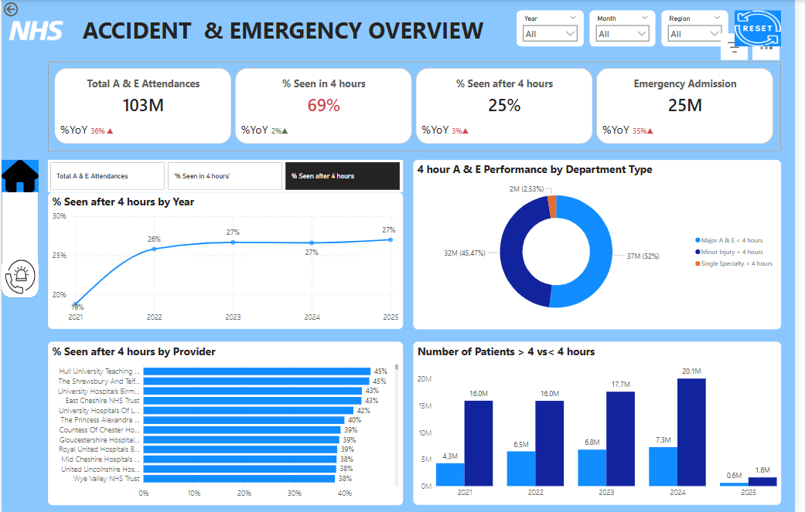
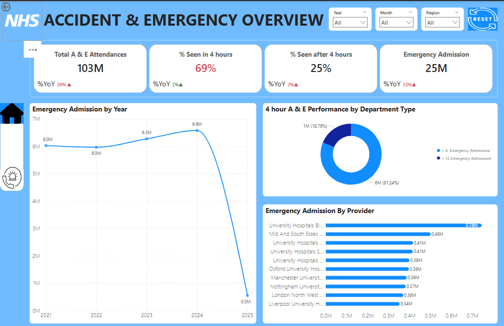

# Project 1

**Title:** [ NHS Accident & Emergency (A&E) Analysis](https://github.com/ugochukwu99/github.io/blob/main/NHS_Data_Analysis.pbix)

# Tools Used:
   - **Power BI Desktop** – for building interactive dashboards and visualizations  
   - **DAX (Data Analysis Expressions)** – to create dynamic KPIs, calculated measures, and business logic  
   - **Power Query (M Language)** – for data cleaning, transformation, and shaping before visualization
  
# Project Description:

   This project presents a comprehensive Power BI dashboard analyzing NHS Accident and Emergency (A&E) data from January 1, 2021 to January 30, 2025. It visualizes critical     KPIs such as total attendances, emergency admissions, and wait time performance across provider trusts and department types.

   The dashboard is divided into two main sections for targeted analysis:

**Accident Dashboard**
  Focuses on attendance trends, 4-hour wait targets, and provider-specific delays.

**Emergency Dashboard**
  Highlights emergency admissions, departmental performance, and provider-level comparisons.

  **Key findings:**
  
  _**Accident Dashboard**_

  What percentage of A&E patients are seen within 4 hours?
  
From the KPI card displayed in the Accident dashboard, 69% of patients were seen within the 4-hour NHS target window. While this represents the majority of cases, it still falls short of the NHS’s benchmark of 95%, indicating ongoing challenges in timely patient care delivery.

How has that performance changed year-over-year?

The data shows a clear performance trajectory over the five-year period. In 2021, 70% of patients were seen within the NHS’s 4-hour target. This percentage declined to 63% in 2022, likely reflecting increased strain on emergency services during that time. Encouragingly, the trend then reverses: performance improves to 69% in 2023, and further strengthens to 73% in both 2024 and early 2025. This upward trend suggests that operational adjustments, resource investments, or improved triage processes have positively impacted service delivery. While the current rate still falls below the NHS’s national 95% target, the consistent year-over-year improvement is a positive signal of recovery and system responsiveness.

Which NHS providers have the highest proportions of patients delayed beyond 4 hours?

The bar chart highlights several NHS trusts with a high percentage of patients waiting beyond the 4-hour target. Notably, Hull University Teaching Hospitals NHS Trust leads with 45% of patients delayed, followed closely by The Shrewsbury and Telford Hospital NHS Trust (43%) and University Hospitals Birmingham NHS Foundation Trust (42%). These elevated delay rates may reflect systemic challenges such as overcrowding, staff shortages, or bed availability issues. Identifying these trusts enables targeted performance improvement initiatives and resource planning to address bottlenecks in urgent care delivery.

Which types of departments (e.g., Major A&E, Minor Injury, Specialty) handle wait times better?

According to the chart Minor Injury Units and Specialty Departments generally perform better, with fewer breaches of the 4-hour target. Major A&E departments tend to have higher delays, likely due to the complexity and volume of cases handled.

 _**Emergency Dashboard**_
 
Are emergency admissions rising or falling over the four-year period?

The "Emergency Admission by Year" chart shows a consistent and measurable increase in emergency admissions from 2021 through 2024, with levels remaining high into early 2025. This sustained rise reflects growing pressure on emergency services, driven by identifiable factors such as an aging population, higher prevalence of chronic conditions. The data clearly signals that demand for emergency care is intensifying, and providers must scale capacity and triage systems to keep pace.

Has the NHS improved its responsiveness and service levels?

From a combined view of the trend charts and admission data, the NHS shows a modest improvement in responsiveness beginning in 2024. However, the increase in admissions has likely placed additional strain on resources, and overall performance remains below the national 95% compliance target.

Dashboard Overview:
# 🚑 Accident Dashboard 
  

# 🏥 Emergency Dashboard 
  
